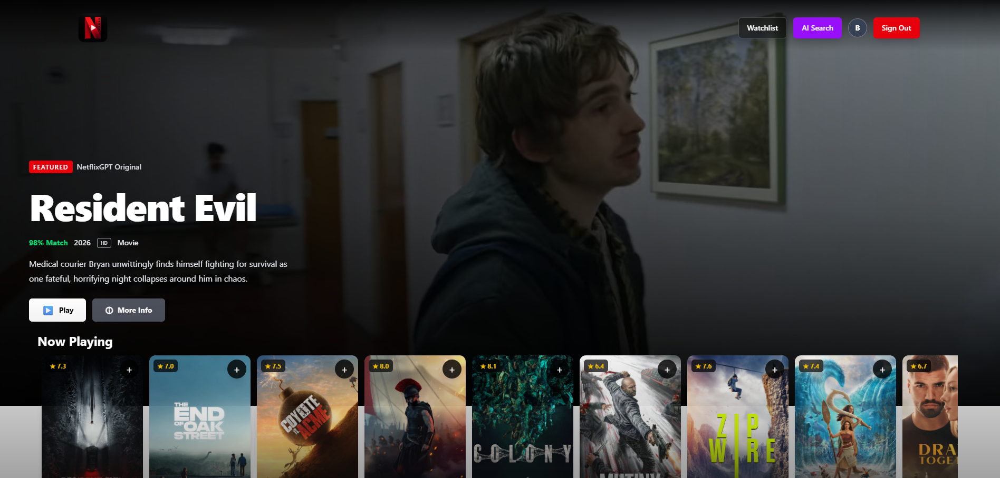
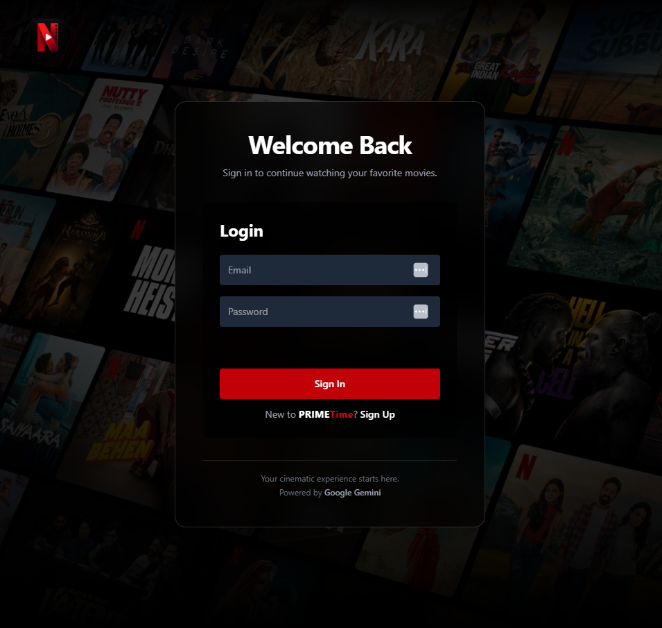
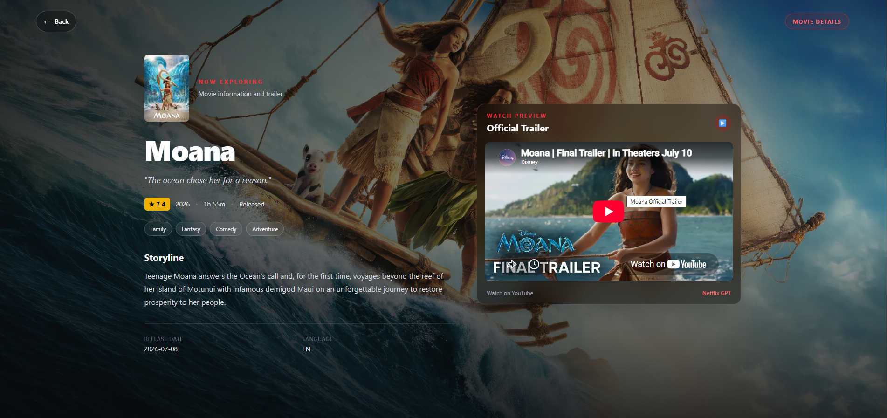
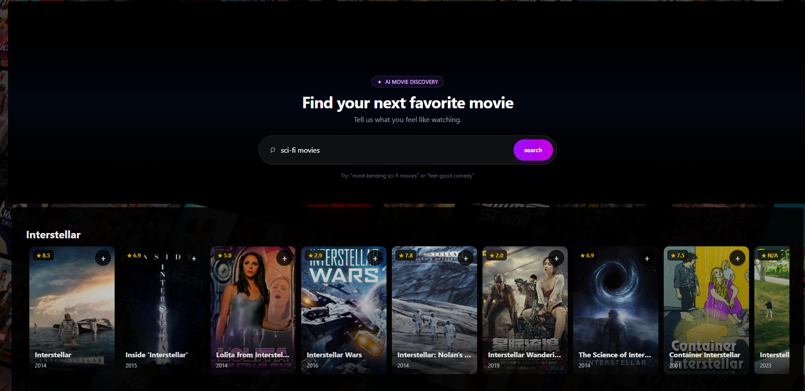
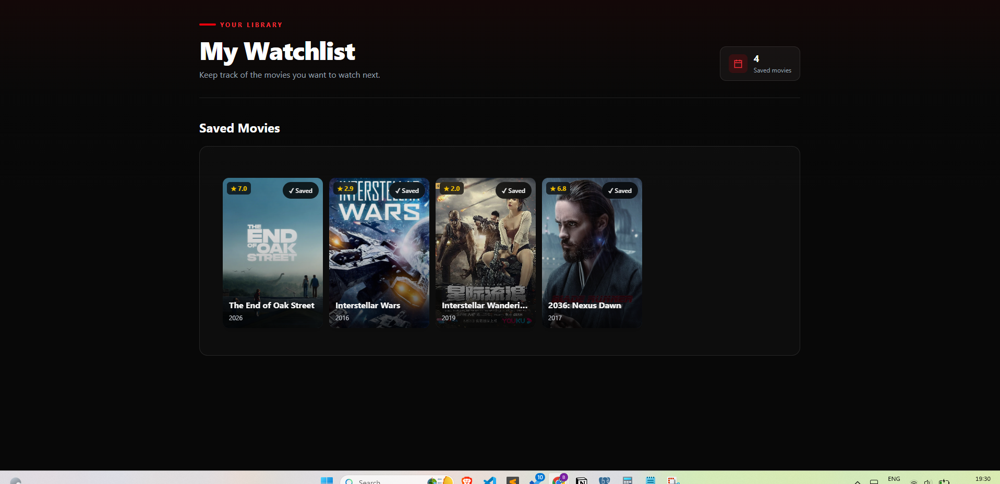

# PrimeTime 🎬

A full-stack movie discovery application built with React, Vite, Django
REST Framework, PostgreSQL, JWT authentication, TMDB, and Gemini AI.

## Live Project

- **Frontend:** https://primetime-26.vercel.app/
- **Backend API:** https://netflix-backend-17vx.onrender.com

> The Render backend may take longer to respond when waking from
> inactivity.

## Screenshots

### Home / Browse Page



### Login Page



### Movie Details



### AI Movie Search



### Watchlist



## Features

- User registration and login
- JWT access and refresh tokens
- Automatic access-token refresh with Axios interceptors
- Protected and public routes
- User profile retrieval
- Movie browsing and movie details
- TMDB posters, backdrops, and video information
- Gemini-powered AI movie recommendations
- Language selection for AI search
- Personal watchlist
- Add, retrieve, and delete watchlist items
- Duplicate watchlist prevention
- Responsive desktop and mobile UI
- Loading, error, and disabled states

## Tech Stack

### Frontend

- React
- Vite
- React Router
- Redux Toolkit
- Axios
- Tailwind CSS
- JavaScript

### Backend

- Python
- Django
- Django REST Framework
- PostgreSQL
- JWT authentication

### Services

- TMDB API
- Gemini API
- Vercel
- Render

## Architecture

```text
PrimeTime
├── React + Vite frontend
│   ├── React Router
│   ├── Redux Toolkit
│   ├── Axios API client
│   └── Tailwind CSS
├── Django + DRF backend
│   ├── Authentication
│   ├── User profile
│   └── Watchlist APIs
└── External services
    ├── TMDB
    └── Gemini
```

## Authentication Flow

1.  The user registers through `register/`.
2.  The backend creates the account.
3.  The user signs in through `token/`.
4.  Access and refresh tokens are stored locally.
5.  Axios attaches the access token to requests.
6.  Expired access tokens are refreshed through `token/refresh/`.
7.  The user's profile is retrieved and stored in Redux.
8.  Protected routes become available to the authenticated user.

## API Endpoints

Method Endpoint Purpose

---

POST `register/` Register a user
POST `token/` Obtain JWT tokens
POST `token/refresh/` Refresh an access token
GET `profile/` Retrieve the current user's profile
GET Watchlist endpoint Retrieve the user's watchlist
POST Watchlist endpoint Add a movie
DELETE Watchlist endpoint Remove a movie

Update the watchlist endpoint names with the exact routes from your
backend.

## Environment Variables

### Frontend

Create a `.env` file:

```env
VITE_API_BASE_URL=http://127.0.0.1:8000/api/
VITE_TMDB_API_KEY=your_tmdb_api_key
VITE_GEMINI_API_KEY=your_gemini_api_key
```

For production:

```env
VITE_API_BASE_URL=https://netflix-backend-17vx.onrender.com/api/
```

### Backend

Use environment variables for values such as:

```env
SECRET_KEY=your_django_secret_key
DEBUG=False
DATABASE_URL=your_database_url
TMDB_API_KEY=your_tmdb_api_key
GEMINI_API_KEY=your_gemini_api_key
```

Use the exact variable names configured in your Django settings.

**Never commit real secrets, API keys, database credentials, or
tokens.**

## Local Setup

### Backend

```bash
cd backend
python -m venv venv
```

Windows:

```bash
venv\Scripts\activate
```

macOS/Linux:

```bash
source venv/bin/activate
```

Install dependencies and run migrations:

```bash
pip install -r requirements.txt
python manage.py migrate
python manage.py runserver
```

### Frontend

In a second terminal:

```bash
cd frontend
npm install
npm run dev
```

## Deployment

### Frontend

The frontend is deployed on Vercel.

Build locally before deployment:

```bash
npm run build
```

For React Router refresh support, configure a Vercel rewrite to
`index.html`.

### Backend

The backend is deployed on Render.

Production considerations include:

- `DEBUG=False`
- Secure environment variables
- Explicit CORS origins
- Correct allowed hosts
- Production database configuration
- Static file configuration
- HTTPS
- Secure authentication settings

## Security Considerations

The application includes authenticated user-specific watchlist
functionality. Important practices include:

- Validate all data on the backend
- Scope watchlist operations to the authenticated user
- Use protected API permissions
- Keep secrets outside source control
- Use explicit CORS origins
- Do not rely only on frontend validation
- Review token storage and session security before production use

PrimeTime is a portfolio project and requires further security hardening
before handling sensitive or high-value data.

## Development Challenges

- Integrating React with Django REST Framework
- Configuring CORS across separate deployments
- Implementing JWT authentication and token refresh
- Preventing Axios refresh recursion
- Handling Render cold starts
- Managing authentication loading states
- Connecting Gemini recommendations with TMDB searches
- Building responsive layouts with Tailwind CSS
- Deploying frontend and backend independently

## Future Improvements

- Automated frontend and backend testing
- Better logging and error monitoring
- Pagination and request optimization
- Code splitting and performance improvements
- Improved session security
- CI/CD automation
- Docker deployment
- Redis and background processing
- Advanced movie filtering and personalization

## Learning Outcomes

- React component architecture
- Redux Toolkit state management
- React Router
- REST API integration
- Django and Django REST Framework
- JWT authentication
- PostgreSQL
- Axios interceptors
- Third-party API integration
- Gemini AI integration
- Responsive UI development
- Deployment and production debugging

## Disclaimer

PrimeTime is an educational and portfolio project. Movie information is
provided through third-party services, including TMDB. The project is
not affiliated with Netflix.

## Author

**Benoy Judy**

- GitHub: https://github.com/juniorjudy123
- LinkedIn: https://www.linkedin.com/in/benoy-judy-6a8049296/
